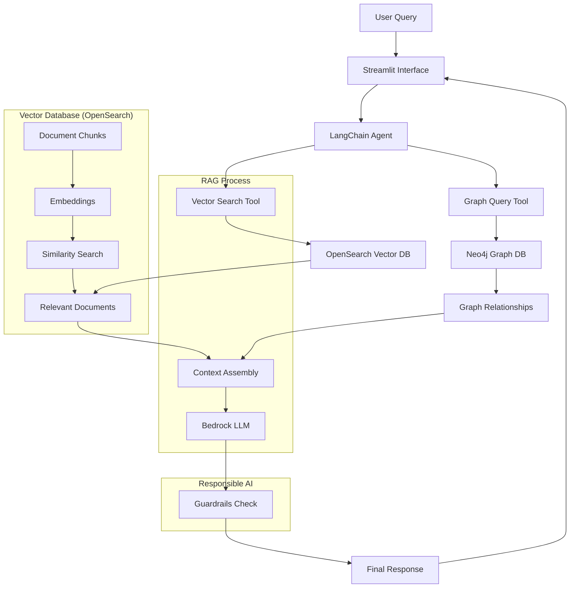

# FraudGraphInsight

A RAG (Retrieval-Augmented Generation) chatbot for fraud detection using LangChain, VectorDB, and AWS Bedrock.

## Features

- Real-time fraud pattern analysis using vector similarity search
- Graph-based relationship analysis using Neo4j
- AWS Bedrock integration for advanced language model capabilities
- Structured chat agent for intelligent query processing
- Interactive Streamlit web interface
- AWS Bedrock Guardrails for responsible AI

## Architecture



### RAG Flow Explanation

1. **User Interface**:
   - Interactive Streamlit web interface
   - Real-time chat experience
   - Configurable settings (confidence threshold, max results)
   - Source attribution and transparency

2. **Query Processing**:
   - User query is received by the LangChain Agent
   - Agent determines which tools to use based on the query

3. **Vector Search Process**:
   - Query is converted to embeddings using Bedrock
   - Similarity search performed in OpenSearch vector store
   - Top-k most relevant documents are retrieved
   - Documents include fraud patterns, case studies, and known patterns

4. **Graph Analysis**:
   - Parallel query to Neo4j for relationship analysis
   - Identifies connected entities and patterns
   - Extracts relevant graph paths and relationships

5. **Context Assembly**:
   - Combines results from vector search and graph analysis
   - Creates comprehensive context for the LLM
   - Includes metadata and confidence scores

6. **Response Generation & Safety**:
   - Bedrock LLM processes the assembled context
   - Response is checked by AWS Bedrock Guardrails
   - Potentially harmful content is filtered or modified
   - Final response is generated with citations

## Vector Database Details

The OpenSearch vector store implementation:
- Uses Bedrock embeddings for document encoding
- Stores document chunks with metadata
- Implements hybrid search (vector + keyword)
- Maintains fraud pattern embeddings
- Supports real-time updates

### Document Structure in Vector DB:
```json
{
    "id": "doc_123",
    "content": "Fraud pattern description...",
    "embedding": [0.1, 0.2, ...],
    "metadata": {
        "pattern_type": "transaction_fraud",
        "severity": "high",
        "timestamp": "2024-01-01",
        "confidence": 0.95
    }
}
```

## Prerequisites

- Python 3.8+
- AWS Account with Bedrock access
- Neo4j Database
- OpenSearch/Elasticsearch instance

## Setup

1. Clone the repository:
```bash
git clone <repository-url>
cd fraud-graph-insight
```

2. Install dependencies:
```bash
pip install -r requirements.txt
```

3. Configure environment variables:
```bash
cp .env.template .env
```
Edit the `.env` file with your actual credentials and configuration.

## Usage

1. Start the Streamlit application:
```bash
streamlit run streamlit_app.py
```

2. Access the web interface at `http://localhost:8501`

3. Example queries:
- "Find suspicious transaction patterns related to account 12345"
- "Analyze relationships between fraudulent accounts"
- "Identify common patterns in recent fraud cases"

## Components

- **Vector Store**: OpenSearch for semantic search of fraud patterns
- **Graph Database**: Neo4j for relationship analysis
- **LLM**: AWS Bedrock (Claude v2) for intelligent response generation
- **Agent**: Structured chat agent for orchestrating the workflow
- **UI**: Streamlit for interactive web interface
- **Safety**: AWS Bedrock Guardrails for content filtering

## Security & Responsible AI

- All sensitive credentials are stored in environment variables
- AWS credentials should be managed using IAM roles where possible
- Database access should be restricted to necessary IP ranges
- AWS Bedrock Guardrails for content filtering and safety
- Configurable confidence thresholds for response quality
- Source attribution for transparency

## License

This project is licensed under the MIT License - see the [LICENSE](LICENSE) file for details.

### License Summary

The MIT License is a permissive free software license originating at the Massachusetts Institute of Technology. It is a simple, permissive license that allows users to:

- Use the software commercially
- Modify the software
- Distribute the software
- Sublicense the software
- Use the software privately

The only requirement is that the original copyright and license notice be included in any substantial portions of the software.

### Third-Party Licenses

This project uses several third-party libraries and services:

1. **LangChain**: MIT License
2. **Neo4j**: GNU General Public License v3.0
3. **OpenSearch**: Apache License 2.0
4. **AWS Bedrock**: AWS Service Terms
5. **Streamlit**: Apache License 2.0

Please refer to the respective documentation of these services for their specific license terms and conditions.

### Contributing

By contributing to this project, you agree that your contributions will be licensed under the MIT License. See [CONTRIBUTING.md](CONTRIBUTING.md) for more details.

### Disclaimer

This software is provided "as is" without warranty of any kind, express or implied. The authors and copyright holders shall not be liable for any claims, damages, or other liabilities arising from the use of this software. 